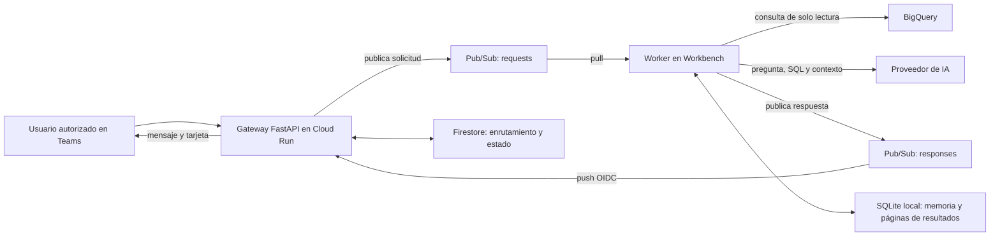

# Guía de instalación: Analytics Agent en Microsoft Teams

> **Estado:** integración aplazada mientras no estén disponibles los permisos para configurar servicios de GCP. Para usar el agente ahora, ejecuta `analytics-agent ask` o `analytics-agent chat` directamente en Workbench; no necesitas seguir esta guía ni configurar Teams.

Esta guía lleva el piloto desde el repositorio hasta una conversación privada funcional en Teams. El gateway se ejecuta en Cloud Run. El worker permanece en `sbs-analytics-python-notebook` (Workbench), donde ya funciona el acceso de BigQuery y el proveedor de IA.

## Arquitectura y recorrido de una pregunta



| Componente | Responsabilidad | Datos que conserva |
|---|---|---|
| Teams | Chat personal con el agente | Conversación visible para sus participantes |
| Cloud Run | Recibir y autenticar actividades, aplicar allowlist y entregar respuestas | Firestore programa el vencimiento de preguntas e identificadores técnicos a 7 días; no guarda filas de BigQuery y el borrado TTL es asíncrono |
| Pub/Sub | Encolar solicitudes y transportar respuestas/heartbeats | Mensajes pendientes mientras los retiene la suscripción |
| Workbench | Ejecutar el agente, BigQuery y llamadas al modelo | SQLite local conserva memoria y resultados para paginarlos; los resultados se consideran vencidos tras 24 horas y se limpian al procesar actividad posterior |
| BigQuery y proveedor de IA | Fuente de datos y generación de consultas/respuestas | Aplican sus permisos y condiciones actuales |

El gateway **no** recibe `LLM_API_KEY` ni permisos de BigQuery. La pregunta del usuario sí pasa por Firestore y por el proveedor de IA; SQL, esquema y contexto se envían desde Workbench al proveedor como en la CLI actual. Los datos detallados se conservan temporalmente en SQLite en Workbench para que los botones de paginación no vuelvan a consultar BigQuery. Usa un disco persistente y restringido en Workbench.

El endpoint HTTP del gateway debe ser alcanzable por Teams. Cloud Run se publica con `--allow-unauthenticated`, pero el SDK valida la identidad del bot y el código limita las actividades a los `aadObjectId` autorizados y a chats `personal`. Si una política de la organización prohíbe servicios públicos, TI debe acordar una arquitectura de entrada permitida antes del despliegue.

## 0. Requisitos y valores del piloto

Esta configuración usa el proyecto `sbscol-dbreplication-prd` y la región `us-east1`. Confirma con TI que Cloud Run, Pub/Sub y Firestore deben vivir en ese proyecto. No ejecutes comandos de creación con otro proyecto seleccionado por accidente.

Necesitas:

- Acceso de despliegue a GCP: activar APIs, crear recursos, asignar IAM, construir la imagen y desplegar Cloud Run.
- Aprobación de TI para una aplicación de Teams y su instalación en los usuarios piloto. El usuario que ejecuta Teams Developer CLI necesita permisos de registro/importación en el tenant.
- `tenantId` de Microsoft Entra y el `Object ID`/`aadObjectId` de cada usuario piloto. El código espera los IDs de objeto, no correos ni nombres de usuario.
- El repositorio actualizado a la integración de Teams, commit `188ac59` o posterior.
- Una terminal persistente en Workbench, acceso ADC a BigQuery y al proveedor de IA ya configurados.
- Node.js/npm para Teams Developer CLI; `gcloud` para GCP; `curl` para revisar el endpoint.

El SDK de Teams para Python requiere Python 3.12 o superior. El gateway ya se construye con Python 3.12 en [Dockerfile.teams](../Dockerfile.teams); Workbench ejecuta el worker con su Python actual y no instala el SDK de Teams. La librería Pub/Sub aún es compatible con Python 3.10+, pero Python 3.10 terminó su ciclo de soporte el 1 de octubre de 2026 y ya no recibe actualizaciones de seguridad. Recomiendo crear el entorno del worker con Python 3.12 si Workbench lo ofrece; si solo ofrece Python 3.10.15, pide a TI actualizar la imagen base y usa el entorno actual de forma temporal solo si la política interna lo permite. [Requisitos del SDK de Teams](https://microsoft.github.io/teams-sdk/python/getting-started/quickstart/) · [Compatibilidad de Pub/Sub](https://docs.cloud.google.com/python/docs/reference/pubsub/latest) · [Fin de soporte de Python 3.10](https://www.python.org/downloads/release/python-31015/).

La aplicación de Teams se creará como bot **Teams-managed**. Para este piloto no hace falta una suscripción Azure ni crear un Azure Bot aparte. Si la política interna exige Azure Bot, consulta a TI antes de registrar la app. [Opciones de bot de Teams](https://microsoft.github.io/teams-sdk/cli/commands/app/create/).

### Identidades que intervienen

| Identidad | Para qué se usa | Roles principales |
|---|---|---|
| `analytics-agent-gateway` (service account) | ADC del servicio Cloud Run | Publicar requests, acceder a Firestore, leer el secreto del bot |
| `analytics-agent-pubsub-push` (service account) | Firma del token OIDC de la suscripción push de respuestas | La cuenta no necesita roles de aplicación; Pub/Sub necesita `roles/iam.serviceAccountTokenCreator` sobre ella |
| Service account de Workbench | ADC del worker | Suscribirse al topic de requests y publicar en responses; conserva los permisos BigQuery existentes |
| Principal que despliega | Crear/actualizar Cloud Run y adjuntar su service account | `roles/run.admin` y `roles/iam.serviceAccountUser` sobre la service account del gateway |
| Identidad que crea la suscripción push | Adjuntar la cuenta OIDC | `roles/iam.serviceAccountUser` sobre `analytics-agent-pubsub-push` |
| Usuario del tenant que registra Teams | Crear/importar la app en Microsoft | Permiso aprobado por los administradores de Teams/Entra |

En tus diagnósticos anteriores, Workbench utilizaba `794609857024-compute@developer.gserviceaccount.com`. Confirma la identidad actual antes de asignarle roles; el worker usa la identidad que entregue ADC, no una clave descargada.

### Permisos de quien prepara la infraestructura

TI puede ejecutar los pasos administrativos o conceder temporalmente los permisos adecuados. No necesitas `Owner` o `Editor` permanente para operar el piloto.

| Tarea de configuración | Rol típico que permite realizarla |
|---|---|
| Habilitar APIs | `roles/serviceusage.serviceUsageAdmin` |
| Crear base Firestore y política TTL | `roles/datastore.owner` |
| Crear topics, subscriptions y asignar sus permisos | `roles/pubsub.admin` |
| Crear service accounts | `roles/iam.serviceAccountAdmin` |
| Conceder roles IAM a nivel de proyecto | TI con `roles/resourcemanager.projectIamAdmin` u otro permiso delegado equivalente |
| Crear Artifact Registry | `roles/artifactregistry.admin` |
| Lanzar builds | `roles/cloudbuild.builds.editor` |
| Crear/actualizar Cloud Run | `roles/run.admin` y `roles/iam.serviceAccountUser` sobre `analytics-agent-gateway` |
| Crear el secreto y subir sus versiones | `roles/secretmanager.admin`; el runtime solo recibe `roles/secretmanager.secretAccessor` en ese secreto |

Las políticas corporativas pueden reemplazar estos roles por roles personalizados o dividir las tareas entre administradores. En particular, no pidas permisos de edición de IAM de proyecto si TI puede aplicar por ti las concesiones de las service accounts.

## 1. Actualizar el repositorio y el entorno de Workbench

Si todavía no tienes el repositorio en Workbench, clónalo desde la terminal con acceso a GitHub:

```bash
mkdir -p ~/proyectos/Test_David/Agent
cd ~/proyectos/Test_David/Agent
git clone https://github.com/3458Robyt/Analytics-Agent.git
```

Si ya tienes el clon, actualiza `main` en esa carpeta:

```bash
cd ~/proyectos/Test_David/Agent/Analytics-Agent
git pull origin main
python3.12 --version
```

Si es la primera instalación, crea `.env` a partir de la plantilla y restringe sus permisos:

```bash
cp .env.example .env
chmod 600 .env
```

Completa `.env` con la configuración aprobada que ya usas para la CLI: proveedor y endpoint del modelo, `LLM_MODEL`, `LLM_API_KEY`, proyecto de BigQuery y ubicación, y URI o ruta local del diccionario si aplica. No guardes el secreto en Git, no lo incluyas en comandos que queden en el historial y no lo pongas en Cloud Run. Si ya existe un `.env` funcional, consérvalo y añade únicamente las variables `TEAMS_*` del paso 9.

Si el comando anterior muestra Python 3.12, crea y prepara un entorno virtual aislado:

```bash
python3.12 -m venv .venv-teams
source .venv-teams/bin/activate
python -m pip install -e ".[teams-worker]"
```

Si `python3.12` no está instalado, no ejecutes los comandos del bloque anterior ni cambies el Python del sistema. Pide a TI que actualice la imagen de Workbench o habilite Python 3.12. Para una prueba temporal, si TI permite mantener Python 3.10, activa el `.venv` existente y ejecuta:

```bash
source .venv/bin/activate
python -m pip install -e ".[teams-worker]"
```

Python 3.10 ya no recibe actualizaciones de seguridad. Si tu clon está en otra ruta, cambia el `cd`. Conserva las variables actuales de BigQuery, el modelo, la clave del proveedor y el diccionario en el `.env` de Workbench. **No copies `LLM_API_KEY` a Cloud Run.**

Comprueba qué identidad usa ADC desde la misma terminal de Workbench:

```python
import google.auth
from google.auth.transport.requests import Request

credentials, adc_project = google.auth.default()
credentials.refresh(Request())
print("Proyecto ADC:", adc_project)
print("Service account:", getattr(credentials, "service_account_email", "no expuesta"))
```

Anota el correo de la service account: lo usarás como `WORKBENCH_SA` en el paso 4. Si el acceso a BigQuery deja de funcionar en la CLI, resuélvelo antes de continuar; Cloud Run no ejecuta consultas BigQuery en esta arquitectura.

## 2. Preparar GCP, APIs y Firestore

Ejecuta estos comandos en Cloud Shell o en una terminal con la identidad de despliegue aprobada. Revisa el proyecto impreso antes de crear recursos:

```bash
gcloud auth list
gcloud config set project sbscol-dbreplication-prd
gcloud config get-value project

export PROJECT_ID=sbscol-dbreplication-prd
export REGION=us-east1
export GATEWAY_SERVICE=analytics-agent-teams-gateway
export REQUEST_TOPIC=analytics-agent-teams-requests
export RESPONSE_TOPIC=analytics-agent-teams-responses
export REQUEST_SUB=analytics-agent-teams-requests-workbench
export RESPONSE_SUB=analytics-agent-teams-responses-cloudrun
export GATEWAY_SA_NAME=analytics-agent-gateway
export PUSH_SA_NAME=analytics-agent-pubsub-push
export GATEWAY_SA="$GATEWAY_SA_NAME@$PROJECT_ID.iam.gserviceaccount.com"
export PUSH_SA="$PUSH_SA_NAME@$PROJECT_ID.iam.gserviceaccount.com"
export PROJECT_NUMBER="$(gcloud projects describe "$PROJECT_ID" --format='value(projectNumber)')"
export PUBSUB_SERVICE_AGENT="service-$PROJECT_NUMBER@gcp-sa-pubsub.iam.gserviceaccount.com"
```

Activa las APIs necesarias. Si alguna ya está activa, GCP la deja habilitada:

```bash
gcloud services enable \
  run.googleapis.com \
  pubsub.googleapis.com \
  firestore.googleapis.com \
  cloudbuild.googleapis.com \
  artifactregistry.googleapis.com \
  secretmanager.googleapis.com \
  iamcredentials.googleapis.com \
  --project="$PROJECT_ID"
```

Si este paso devuelve `Permission denied to enable service` para `serviceusage.services.enable`, tu cuenta no puede activar APIs. Pide a TI que active esas APIs o que te conceda temporalmente `roles/serviceusage.serviceUsageAdmin` en el proyecto; no hace falta que te asignen `Owner`. Si luego Firestore devuelve `PERMISSION_DENIED` al crear la base, TI debe crearla o concederte temporalmente `roles/datastore.owner`. Para activar el TTL se requiere el permiso de actualización de índices/esquemas (`datastore.indexes.update`, también llamado `datastore.schemas.update`), incluido en `roles/datastore.indexAdmin`; `roles/datastore.owner` también lo incluye, pero concede acceso más amplio. [Permisos de Service Usage](https://docs.cloud.google.com/service-usage/docs/enable-disable) · [Permisos Firestore](https://docs.cloud.google.com/iam/docs/roles-permissions/firestore) · [Permisos TTL](https://docs.cloud.google.com/datastore/docs/ttl).

Después de que TI habilite las APIs, confirma el estado antes de continuar:

```bash
gcloud services list --enabled --project="$PROJECT_ID"
```

Revisa la base de Firestore antes de crearla:

```bash
gcloud firestore databases list --project="$PROJECT_ID"
```

Si no existe la base `(default)`, créala en `us-east1`. Si ya existe, **no la crees otra vez**; verifica con TI su ubicación y continúa usando esa base:

```bash
gcloud firestore databases create \
  --database='(default)' \
  --location="$REGION" \
  --type=firestore-native \
  --project="$PROJECT_ID"
```

Activa la política TTL para que Firestore pueda eliminar documentos cuyo campo `expires_at` haya vencido:

```bash
gcloud firestore fields ttls update expires_at \
  --collection-group=items \
  --enable-ttl \
  --database='(default)' \
  --project="$PROJECT_ID"
```

La activación del TTL puede tardar varios minutos y la eliminación es asíncrona. Esto no impide el funcionamiento de la conversación. El gateway establece vencimientos de siete días; los resultados analíticos se guardan localmente en Workbench durante 24 horas. [Configuración TTL](https://docs.cloud.google.com/firestore/native/docs/ttl).

## 3. Crear topics, suscripción pull y cuentas de servicio

Crea dos topics. Estos comandos se ejecutan una sola vez; si ya existen, confirma que pertenecen al proyecto correcto y no los vuelvas a crear:

```bash
gcloud pubsub topics create "$REQUEST_TOPIC" --project="$PROJECT_ID"
gcloud pubsub topics create "$RESPONSE_TOPIC" --project="$PROJECT_ID"
```

Si la terminal siguió ejecutando comandos después de un error anterior, es posible que algunos recursos sí se hayan creado. Compruébalos con `gcloud pubsub topics describe "$REQUEST_TOPIC" --project="$PROJECT_ID"`, `gcloud pubsub topics describe "$RESPONSE_TOPIC" --project="$PROJECT_ID"` y `gcloud pubsub subscriptions describe "$REQUEST_SUB" --project="$PROJECT_ID"`; omite los comandos `create` para cualquier recurso que ya exista.

La suscripción pull de solicitudes la consume Workbench. Se habilita orden por `ordering_key` para mantener juntos los mensajes de una conversación, con plazo de ACK suficiente para una consulta larga:

```bash
gcloud pubsub subscriptions create "$REQUEST_SUB" \
  --project="$PROJECT_ID" \
  --topic="$REQUEST_TOPIC" \
  --enable-message-ordering \
  --ack-deadline=600
```

Crea las dos service accounts administradas por el cliente. No descargues claves JSON para ellas:

```bash
gcloud iam service-accounts create "$GATEWAY_SA_NAME" \
  --display-name="Analytics Agent Teams Gateway" \
  --project="$PROJECT_ID"

gcloud iam service-accounts create "$PUSH_SA_NAME" \
  --display-name="Analytics Agent Pub/Sub push OIDC" \
  --project="$PROJECT_ID"
```

Pub/Sub crea su service agent al habilitar/usar el servicio. Si el principal calculado en `PUBSUB_SERVICE_AGENT` aún no aparece y falla la concesión IAM del paso 8, créalo explícitamente y vuelve a intentarlo:

```bash
gcloud beta services identity create \
  --service=pubsub.googleapis.com \
  --project="$PROJECT_ID"
```

Asigna solo los permisos que necesita cada runtime. La service account de Cloud Run puede publicar requests y leer/escribir los documentos de entrega en Firestore:

```bash
gcloud pubsub topics add-iam-policy-binding "$REQUEST_TOPIC" \
  --project="$PROJECT_ID" \
  --member="serviceAccount:$GATEWAY_SA" \
  --role=roles/pubsub.publisher

gcloud projects add-iam-policy-binding "$PROJECT_ID" \
  --member="serviceAccount:$GATEWAY_SA" \
  --role=roles/datastore.user
```

La service account de Workbench puede leer requests y publicar respuestas:

```bash
export WORKBENCH_SA="<correo-de-la-service-account-confirmado-en-workbench>"

gcloud pubsub subscriptions add-iam-policy-binding "$REQUEST_SUB" \
  --project="$PROJECT_ID" \
  --member="serviceAccount:$WORKBENCH_SA" \
  --role=roles/pubsub.subscriber

gcloud pubsub topics add-iam-policy-binding "$RESPONSE_TOPIC" \
  --project="$PROJECT_ID" \
  --member="serviceAccount:$WORKBENCH_SA" \
  --role=roles/pubsub.publisher
```

No agregues permisos BigQuery a la cuenta de Cloud Run. Workbench conserva sus permisos BigQuery actuales.

La persona que despliega Cloud Run debe poder usar la service account del gateway. Sustituye el valor por el principal que realmente despliega, por ejemplo `user:correo@empresa.com` o `serviceAccount:...`:

```bash
export DEPLOYER_MEMBER="user:<correo-del-desplegador>"

gcloud projects add-iam-policy-binding "$PROJECT_ID" \
  --member="$DEPLOYER_MEMBER" \
  --role=roles/run.admin

gcloud iam service-accounts add-iam-policy-binding "$GATEWAY_SA" \
  --project="$PROJECT_ID" \
  --member="$DEPLOYER_MEMBER" \
  --role=roles/iam.serviceAccountUser
```

Si tu política corporativa usa roles personalizados, TI puede conceder permisos equivalentes en vez de roles predefinidos. Para crear los topics, asignar IAM, configurar Secret Manager y desplegar Cloud Run hacen falta permisos de administración en cada recurso; no uses `Owner` o `Editor` como solución permanente.

## 4. Construir la imagen de Cloud Run

Desde la raíz del clon actualizado del repositorio, crea el repositorio de Artifact Registry una sola vez. Si ya existe, continúa con la compilación:

```bash
gcloud artifacts repositories create analytics-agent \
  --repository-format=docker \
  --location="$REGION" \
  --project="$PROJECT_ID"
```

Construye el gateway con Cloud Build. Usa una etiqueta distinta en cada publicación para identificar la imagen desplegada:

```bash
export IMAGE_TAG="teams-pilot-$(date -u +%Y%m%d%H%M%S)"

gcloud builds submit \
  --project="$PROJECT_ID" \
  --region="$REGION" \
  --config=cloudbuild-teams.yaml \
  --substitutions="_REGION=$REGION,_TAG=$IMAGE_TAG" \
  .

export IMAGE="$REGION-docker.pkg.dev/$PROJECT_ID/analytics-agent/teams-gateway:$IMAGE_TAG"
```

Cloud Build en el mismo proyecto normalmente puede publicar en Artifact Registry. Si la compilación termina con `permission denied` al subir la imagen, TI debe conceder `roles/artifactregistry.writer` a la service account que aparece como identidad del build, idealmente solo sobre el repositorio `analytics-agent`. [Permisos de Artifact Registry](https://docs.cloud.google.com/artifact-registry/docs/access-control).

## 5. Desplegar el gateway inicialmente

Primero despliega el servicio sin credenciales de bot. Esto fija una URL HTTPS; `/healthz` queda disponible y el middleware devuelve `503` en `/api/messages` hasta que se configure `CLIENT_ID` y `CLIENT_SECRET`.

Obtén estos datos de TI antes de ejecutar el comando:

- `TENANT_ID`: ID del tenant de Microsoft Entra.
- `ALLOWED_USER_IDS`: IDs de objeto de los usuarios autorizados, separados por coma.
- `PUSH_SA`: cuenta OIDC creada en el paso anterior.

```bash
export TENANT_ID="<tenant-id-de-entra>"
export ALLOWED_USER_IDS="<aad-object-id-1>,<aad-object-id-2>"
export PUSH_AUDIENCE=analytics-agent-teams-pubsub

gcloud run deploy "$GATEWAY_SERVICE" \
  --project="$PROJECT_ID" \
  --region="$REGION" \
  --image="$IMAGE" \
  --service-account="$GATEWAY_SA" \
  --allow-unauthenticated \
  --cpu=1 \
  --memory=1Gi \
  --min=0 \
  --max=1 \
  --set-env-vars="^|^TEAMS_TENANT_ID=$TENANT_ID|TEAMS_ALLOWED_USER_IDS=$ALLOWED_USER_IDS|TEAMS_GCP_PROJECT=$PROJECT_ID|TEAMS_REQUEST_TOPIC=$REQUEST_TOPIC|TEAMS_PUBSUB_PUSH_AUDIENCE=$PUSH_AUDIENCE|TEAMS_PUBSUB_PUSH_SERVICE_ACCOUNT=$PUSH_SA"
```

El separador personalizado `|` permite que `TEAMS_ALLOWED_USER_IDS` contenga comas. `--set-env-vars` reemplaza la lista de variables de la revisión: si vuelves a usar ese flag, incluye todas las variables requeridas. Para cambios puntuales usa `--update-env-vars`.

Obtén la URL y revisa la respuesta:

```bash
export SERVICE_URL="$(gcloud run services describe "$GATEWAY_SERVICE" \
  --project="$PROJECT_ID" \
  --region="$REGION" \
  --format='value(status.url)')"

curl -i "$SERVICE_URL/healthz"
```

Debe devolver HTTP `200` y `{"status":"ok"}`. Todavía no instales la aplicación; el endpoint de mensajes responderá `503` hasta añadir las credenciales del bot.

El servicio es público a nivel de Cloud Run porque Teams debe poder alcanzarlo. El SDK verifica la actividad autenticada y el gateway vuelve a verificar tenant, chat privado y allowlist. Esta configuración debe aprobarla TI si la organización controla servicios `allUsers`.

## 6. Registrar la aplicación de Teams

Instala la CLI oficial desde un equipo autorizado para registrar apps en el tenant:

```bash
npm install -g @microsoft/teams.cli
teams --version
teams login
teams status
```

`teams app create` registra la app y el bot. El CLI guarda `CLIENT_ID`, `CLIENT_SECRET` y `TENANT_ID` en el archivo indicado. Usa `umask 077` para que el archivo quede privado:

```bash
umask 077
teams app create \
  --teams-managed \
  --name "Analytics Agent" \
  --endpoint "$SERVICE_URL/api/messages" \
  --env-file .env.teams-registration
chmod 600 .env.teams-registration
```

Si el CLI presenta un selector de ámbitos durante el registro, elige únicamente **Personal**. Después de crearla, fija el ámbito desde la CLI para que el manifiesto no incluya chat grupal ni canales:

```bash
teams app list
export TEAMS_APP_ID="<id-de-la-app-en-el-catalogo-de-teams>"

teams app update "$TEAMS_APP_ID" \
  --endpoint "$SERVICE_URL/api/messages" \
  --scopes personal
```

`TEAMS_APP_ID` es el ID de la app en Teams. `CLIENT_ID` es la identidad de aplicación del bot; no los trates como variables intercambiables. El archivo `.env.teams-registration` incluye el secreto del bot y está excluido por `.gitignore`: no lo subas al repositorio ni lo pegues en tickets o logs.

Si la política del tenant bloquea el registro o la importación, solicita a TI que autorice la app y su distribución a los usuarios piloto. No intentes eludir la política del tenant.

## 7. Guardar el secreto del bot y activar el endpoint

El secreto se guarda solo en Secret Manager para Cloud Run. Crea el secreto una vez:

```bash
export BOT_SECRET_NAME=analytics-agent-teams-client-secret

gcloud secrets create "$BOT_SECRET_NAME" \
  --replication-policy=automatic \
  --project="$PROJECT_ID"
```

En la terminal donde creaste `.env.teams-registration`, introduce el valor de `CLIENT_SECRET` cuando se solicite. La entrada no se muestra en pantalla ni forma parte del historial del comando:

```bash
read -rsp "Pega el CLIENT_SECRET generado por Teams: " BOT_CLIENT_SECRET
printf '\n'
printf '%s' "$BOT_CLIENT_SECRET" | \
  gcloud secrets versions add "$BOT_SECRET_NAME" \
    --data-file=- \
    --project="$PROJECT_ID"
unset BOT_CLIENT_SECRET
```

Permite que solo el runtime de Cloud Run lea ese secreto:

```bash
gcloud secrets add-iam-policy-binding "$BOT_SECRET_NAME" \
  --project="$PROJECT_ID" \
  --member="serviceAccount:$GATEWAY_SA" \
  --role=roles/secretmanager.secretAccessor
```

Lee `CLIENT_ID` del archivo de registro y colócalo en una variable local. Es un identificador, no el secreto:

```bash
export CLIENT_ID="<client-id-del-bot-generado-por-teams>"
```

Actualiza el servicio con el ID y referencia la versión `1` del secreto. La versión fija evita que un cambio de `latest` provoque que un contenedor arranque con un secreto distinto sin una nueva revisión. `TENANT_ID` debe coincidir con `TEAMS_TENANT_ID`:

```bash
gcloud run services update "$GATEWAY_SERVICE" \
  --project="$PROJECT_ID" \
  --region="$REGION" \
  --update-env-vars="CLIENT_ID=$CLIENT_ID,TENANT_ID=$TENANT_ID" \
  --update-secrets="CLIENT_SECRET=$BOT_SECRET_NAME:1"
```

Verifica el estado y los logs:

```bash
curl -i "$SERVICE_URL/healthz"
gcloud run services describe "$GATEWAY_SERVICE" \
  --project="$PROJECT_ID" --region="$REGION" \
  --format='yaml(status.url,status.conditions)'
gcloud run services logs read "$GATEWAY_SERVICE" \
  --project="$PROJECT_ID" --region="$REGION" --limit=100

teams app doctor "$TEAMS_APP_ID"
```

No configures `LLM_API_KEY`, ADC ni roles BigQuery en Cloud Run. Las consultas y llamadas al modelo salen de Workbench.

Secret Manager recomienda pinnear una versión cuando el secreto se entrega como variable de entorno. Para rotarlo, agrega una nueva versión y actualiza el servicio a esa versión, por ejemplo `:2`; no sustituyas el secreto anterior hasta que el gateway esté saludable. [Secretos en Cloud Run](https://docs.cloud.google.com/run/docs/configuring/services/secrets).

## 8. Crear la suscripción push de respuestas con OIDC

La suscripción push requiere una cuenta de servicio del mismo proyecto que Pub/Sub. Pub/Sub firma un token y el gateway valida su audiencia y el correo exacto de la cuenta.

Concede al agente de servicio de Pub/Sub el rol Token Creator **sobre la cuenta OIDC de push**. Si el agente de servicio aún no existe después de habilitar Pub/Sub, TI puede aprovisionar la identidad de servicio de Pub/Sub y repetir la concesión:

```bash
gcloud iam service-accounts add-iam-policy-binding "$PUSH_SA" \
  --project="$PROJECT_ID" \
  --member="serviceAccount:$PUBSUB_SERVICE_AGENT" \
  --role=roles/iam.serviceAccountTokenCreator
```

Concede `roles/iam.serviceAccountUser` sobre esa misma cuenta al principal que ejecutará el siguiente comando. Sustituye el valor por el usuario o service account real:

```bash
export SUBSCRIPTION_CREATOR="user:<correo-del-creador-de-la-suscripcion>"

gcloud iam service-accounts add-iam-policy-binding "$PUSH_SA" \
  --project="$PROJECT_ID" \
  --member="$SUBSCRIPTION_CREATOR" \
  --role=roles/iam.serviceAccountUser
```

Ahora crea la suscripción que lleva respuestas y heartbeats de Workbench a Cloud Run:

```bash
gcloud pubsub subscriptions create "$RESPONSE_SUB" \
  --project="$PROJECT_ID" \
  --topic="$RESPONSE_TOPIC" \
  --enable-message-ordering \
  --push-endpoint="$SERVICE_URL/internal/pubsub/results" \
  --push-auth-service-account="$PUSH_SA" \
  --push-auth-token-audience="$PUSH_AUDIENCE" \
  --ack-deadline=60
```

El valor de `--push-auth-token-audience` debe ser exactamente igual a `TEAMS_PUBSUB_PUSH_AUDIENCE` (`analytics-agent-teams-pubsub`). El correo usado en `--push-auth-service-account` debe coincidir exactamente con `TEAMS_PUBSUB_PUSH_SERVICE_ACCOUNT`. Cloud Run se mantiene alcanzable para Teams y el código valida el OIDC en la ruta `/internal/pubsub/results`; la guía de Pub/Sub explica los permisos `actAs` y Token Creator. [Autenticación OIDC en push](https://docs.cloud.google.com/pubsub/docs/authenticate-push-subscriptions).

La entrega de Pub/Sub es al menos una vez. El worker conserva el ID de solicitud y usa un ID determinista para los jobs BigQuery; aun así, una respuesta de Teams podría repetirse si la red falla justo después de enviarla. [Orden de mensajes](https://docs.cloud.google.com/pubsub/docs/ordering).

## 9. Configurar y arrancar el worker de Workbench

En Workbench, edita el `.env` existente y añade estos valores. Sustituye tenant y usuarios por los aprobados; conserva la configuración actual de LLM, BigQuery y diccionario:

```dotenv
TEAMS_TENANT_ID=<tenant-id-de-entra>
TEAMS_ALLOWED_USER_IDS=<aad-object-id-1>,<aad-object-id-2>
TEAMS_GCP_PROJECT=sbscol-dbreplication-prd
TEAMS_REQUEST_SUBSCRIPTION=analytics-agent-teams-requests-workbench
TEAMS_RESPONSE_TOPIC=analytics-agent-teams-responses
TEAMS_REQUEST_MAX_AGE_SECONDS=900
```

El worker **no** necesita `CLIENT_ID`, `CLIENT_SECRET` ni `TEAMS_PUBSUB_PUSH_*`. Protege el `.env`:

```bash
chmod 600 .env
```

Vuelve a la raíz del repositorio y activa el entorno que elegiste. El ejemplo usa `.venv-teams`; si TI autorizó la prueba temporal con Python 3.10, activa `.venv`:

```bash
cd ~/proyectos/Test_David/Agent/Analytics-Agent
source .venv-teams/bin/activate
python -m pip install -e ".[teams-worker]"
```

Arranca una sola instancia del worker. Para dejarla corriendo al cerrar la pestaña SSH usa una sesión persistente de `tmux`:

```bash
tmux new -s analytics-agent-teams
analytics-agent --env-file .env teams-worker
```

Al ver `Teams worker activo`, deja el proceso abierto y desconéctate de `tmux` con `Ctrl+B` y luego `D`. Para volver a la sesión usa `tmux attach -t analytics-agent-teams`. Para detenerlo, vuelve a la sesión y pulsa `Ctrl+C`. Si Workbench se reinicia, vuelve a arrancar el proceso. Mantén la ruta `ANALYTICS_AGENT_STATE_DIR` (si la configuraste) en un disco persistente; si no la configuras, el agente usa `~/.local/share/analytics-agent`.

Espera hasta 30 segundos al primer heartbeat. El gateway marca Workbench como disponible cuando recibe ese heartbeat mediante la suscripción push. Revisa la salida del worker para errores de credenciales o de Pub/Sub.

## 10. Instalar la app y hacer la prueba de aceptación

Obtén el enlace de instalación de Teams y ábrelo con una cuenta piloto:

```bash
teams app get "$TEAMS_APP_ID" --install-link
```

Si el tenant exige revisión, TI debe aprobar la app en el centro de administración de Teams antes de que aparezca para los usuarios. Instálala en un chat personal; no la agregues a equipos, canales ni chats grupales. La CLI oficial permite actualizar ámbitos y comprobar el registro con `teams app doctor`. [Comandos de Teams Developer CLI](https://microsoft.github.io/teams-sdk/cli/commands/app/update/).

Prueba en este orden:

1. Abre el enlace `/healthz`: debe responder `200`.
2. Confirma que el worker está activo y no reporta `PermissionDenied` de Pub/Sub.
3. En Teams, envía un mensaje corto al bot desde un usuario incluido en `TEAMS_ALLOWED_USER_IDS`.
4. Debes recibir primero el acuse de recibo y luego una tarjeta con resumen y tabla.
5. Si la tabla tiene más de diez filas, pulsa **Siguiente página**; para más de cinco columnas, pulsa **Más columnas**. La navegación usa el resultado almacenado y no vuelve a consultar BigQuery.
6. Pulsa **Ver SQL y trazabilidad** si necesitas revisar el cálculo. La respuesta normal presenta el resumen; la consulta y su auditoría se muestran bajo demanda.
7. Pulsa **Reportar una corrección**, escribe el comentario en el mismo chat y confirma que quedó guardado.
8. Envía una segunda pregunta en el mismo chat y verifica que continúa la sesión. Usa **Nueva consulta** para iniciar otra.
9. Repite con un usuario que no esté autorizado; debe recibir el mensaje de acceso restringido y no se debe llamar al agente.
10. Revisa `analytics-agent --env-file .env teams feedback list` en Workbench para consultar las observaciones guardadas.

Como Pub/Sub puede redeliver mensajes, también vuelve a enviar una pregunta después de una interrupción controlada y confirma que no crea dos jobs BigQuery para la misma solicitud. No pruebes con consultas de producción cuyo costo no hayas revisado.

## 11. Comprobaciones y solución de problemas

### Revisar recursos y estado

```bash
gcloud pubsub subscriptions describe "$REQUEST_SUB" \
  --project="$PROJECT_ID" \
  --format='yaml(name,topic,ackDeadlineSeconds,enableMessageOrdering)'

gcloud pubsub subscriptions describe "$RESPONSE_SUB" \
  --project="$PROJECT_ID" \
  --format='yaml(name,topic,pushConfig,ackDeadlineSeconds,enableMessageOrdering)'

gcloud run services describe "$GATEWAY_SERVICE" \
  --project="$PROJECT_ID" --region="$REGION" \
  --format='yaml(status.url,status.conditions)'

gcloud run services logs read "$GATEWAY_SERVICE" \
  --project="$PROJECT_ID" --region="$REGION" --limit=100
```

| Síntoma | Revisión |
|---|---|
| `/healthz` no devuelve `200` | Revisa el estado de Cloud Run, el puerto `8080`, el arranque del contenedor y los logs del servicio. |
| `/api/messages` devuelve `503` | Falta `CLIENT_ID` o `CLIENT_SECRET`, o Cloud Run no puede leer la versión fijada de Secret Manager. Revisa el runtime SA y crea una nueva revisión con `gcloud run services update`. |
| El bot dice que Workbench está desconectado | El worker no está corriendo, no tiene permiso de publicar en `RESPONSE_TOPIC`, o la suscripción push no está entregando heartbeats. Confirma `RESPONSE_SUB`, OIDC y el log del worker. |
| Pub/Sub push devuelve `401` / “OIDC inválido” | Compara audiencia exacta, correo de la cuenta OIDC y `TEAMS_PUBSUB_PUSH_SERVICE_ACCOUNT`; confirma el rol Token Creator del agente Pub/Sub. |
| Pub/Sub push no puede crear la suscripción | El creador necesita `iam.serviceAccounts.actAs` (`roles/iam.serviceAccountUser`) sobre la cuenta OIDC. |
| Worker recibe `PermissionDenied` en Pub/Sub | Confirma que los roles se asignaron al correo ADC real de Workbench y al recurso correcto: subscriber en la suscripción y publisher en el topic. |
| La pregunta se acepta pero no llega tarjeta | Mira el backlog de `REQUEST_SUB`, salida del worker y logs de Cloud Run. Si el modelo o BigQuery tardan, el worker puede seguir procesando; el mensaje caduca para procesamiento a los 15 minutos. |
| BigQuery da `403` o error VPC | El job corre en Workbench. Revisa ADC, IAM/VPC y el `BQ_JOB_PROJECT` allí; cambiar permisos de Cloud Run no arregla permisos BigQuery del worker. |
| No se puede publicar una app de Teams | Pide a TI que apruebe el registro, la app personalizada y la instalación para el grupo piloto; confirma que el manifiesto tiene solo el ámbito `personal`. |

## 12. Operación, cambios y siguientes pasos

- Deja Workbench encendido y el worker en `tmux`; si el runtime se apaga, el gateway mostrará que el worker está desconectado.
- Para cambiar usuarios, actualiza `TEAMS_ALLOWED_USER_IDS` tanto en Cloud Run como en el `.env` de Workbench y despliega una revisión nueva. La app seguirá siendo `personal`.
- Para rotar el secreto: genera uno nuevo desde Teams Developer CLI, añade una nueva versión a Secret Manager y actualiza Cloud Run a esa versión. No lo incluyas en Git.
- Las correcciones se guardan en la SQLite local del worker; crea un proceso humano para revisarlas. No se convierten automáticamente en reglas o memoria aprobada.
- Define y valida con el área de negocio las métricas sin documentación suficiente, especialmente incurrido neto, reservas, fechas, moneda y movimientos. Añade preguntas con SQL y cifras de referencia a los casos de evaluación antes de cambiar prompts o reglas.
- Mide por separado el tiempo del modelo, BigQuery y entrega a Teams. Tras el piloto, decide con TI si el worker debe convertirse en un servicio persistente administrado, manteniendo el acceso permitido a BigQuery.

## Referencias oficiales

- [Teams SDK para Python: instalación y Quickstart](https://microsoft.github.io/teams-sdk/python/getting-started/quickstart/)
- [Teams Developer CLI: crear una app](https://microsoft.github.io/teams-sdk/cli/commands/app/create/)
- [Teams Developer CLI: actualizar ámbitos y endpoint](https://microsoft.github.io/teams-sdk/cli/commands/app/update/)
- [Cloud Run: identidad del servicio](https://docs.cloud.google.com/run/docs/configuring/services/service-identity)
- [Cloud Run: variables y secretos](https://docs.cloud.google.com/run/docs/configuring/services/secrets)
- [Pub/Sub: autenticación de push con OIDC](https://docs.cloud.google.com/pubsub/docs/authenticate-push-subscriptions)
- [Pub/Sub: orden de mensajes](https://docs.cloud.google.com/pubsub/docs/ordering)
- [Firestore: políticas TTL](https://docs.cloud.google.com/firestore/native/docs/ttl)
